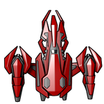

[![Contributors][contributors-shield]][contributors-url]
[![Forks][forks-shield]][forks-url]
[![Stargazers][stars-shield]][stars-url]
[![Issues][issues-shield]][issues-url]
[![MIT License][license-shield]][license-url]

<!-- PROJECT LOGO -->
<br />
<p align="center">
  <a href="https://github.com/theBenEdwards/">
    
  </a>

  <h3 align="center">Space Offensive</h3>

  <p align="center">
    Final Year Project at Barnard Castle School
    <br />
    <a href="https://github.com/TheBenEdwards/SpaceOffensive"><strong>Explore the code »</strong></a>
    <br />
    <br />
    <a href="https://github.com/TheBenEdwards/SpaceOffensive/issues">Report a Bug</a>
    ·
    <a href="https://github.com/TheBenEdwards/SpaceOffensive/pulls">View Pull Requests</a>
    ·
    <a href="https://github.com/TheBenEdwards/SpaceOffensive/dependencies">Dependencies</a>
  </p>
</p>

<!-- TABLE OF CONTENTS -->
<details open="open">
  <summary>Table of Contents</summary>
  <ol>
    <li>
      <a href="#about-the-project">About The Project</a>
      <ul>
        <li><a href="#built-with">Built With</a></li>
      </ul>
    </li>
    <li>
      <a href="#getting-started">Getting Started</a>
    </li>
    <li><a href="#the-team">The Team</a></li>
     <li><a href="#acknowledgements">Acknowledgements</a></li>
  </ol>
</details>

<!-- ABOUT THE PROJECT -->

## About The Project

The aim of this project was to create a game that utilises the pygame addition to the Python Langauge.

This is the list of dependencies and tools we used to create this project:

### Built With

-   [Python](https://www.python.org/)
-   [PyGame](https://www.pygame.org/)

<!-- GETTING STARTED -->

## Getting Started

To just 'check out' the project and see how we got the code to work, clone the repo. This will create a completely detached directory for you to do whatever you want to the code.

-   Clone the repo

```sh
git clone https://github.com/theBenEdwards/SpaceOffensive.git
```

<!-- THE TEAM -->

## The Team

<ul>
  <li>Benjamin Edwards</li>
</ul>

<!-- ACKNOWLEDGEMENTS -->

## Acknowledgements

My First ever coding project! A lot of fun!

<!-- MARKDOWN LINKS & IMAGES -->

[contributors-shield]: https://img.shields.io/github/contributors/theBenEdwards/SpaceOffensive.svg?style=for-the-badge
[contributors-url]: https://github.com/theBenEdwards/SpaceOffensive/graphs/contributors
[forks-shield]: https://img.shields.io/github/forks/theBenEdwards/SpaceOffensive.svg?style=for-the-badge
[forks-url]: https://github.com/theBenEdwards/SpaceOffensive/network/members
[stars-shield]: https://img.shields.io/github/stars/theBenEdwards/SpaceOffensive.svg?style=for-the-badge
[stars-url]: https://github.com/theBenEdwards/SpaceOffensive/stargazers
[issues-shield]: https://img.shields.io/github/issues/theBenEdwards/SpaceOffensive.svg?style=for-the-badge
[issues-url]: https://github.com/theBenEdwards/SpaceOffensive/issues
[license-shield]: https://img.shields.io/github/license/theBenEdwards/SpaceOffensive.svg?style=for-the-badge
[license-url]: https://github.com/theBenEdwards/SpaceOffensive/blob/main/LICENSE.txt
